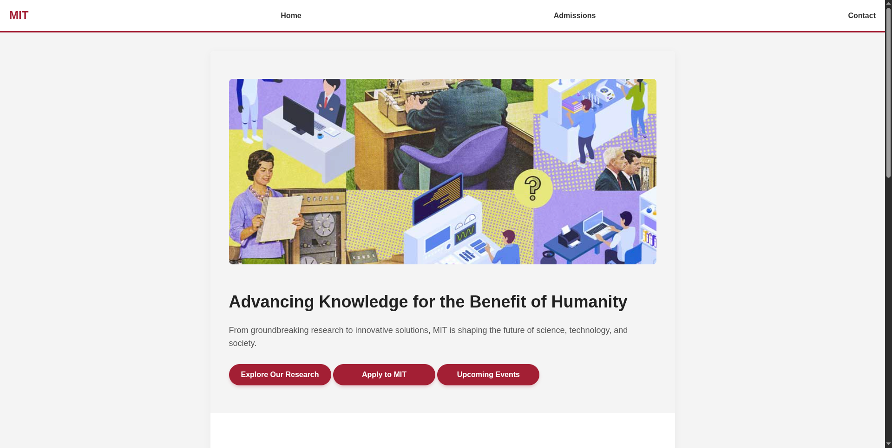
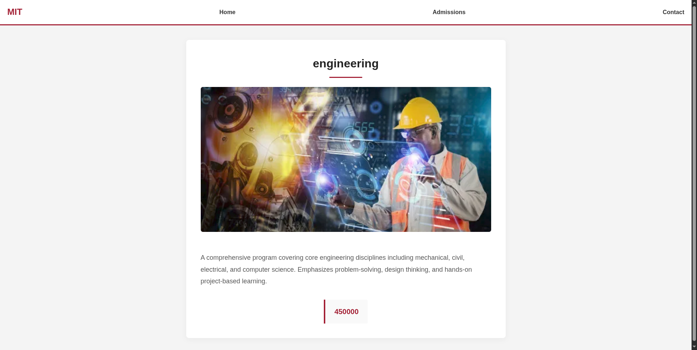
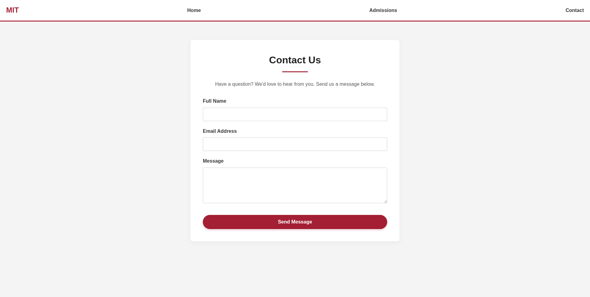

# MIT Web UI

A simple multi-page college website built using Node.js, Express.js, and EJS. The project provides a basic university portal featuring a homepage, admissions section, contact page, and course information pages for different academic streams.

## Features

* Multi-page website structure
* Home page with university overview
* Admissions page with available streams
* Contact form interface
* Course pages for Engineering, Commerce, and Science
* Responsive navigation bar
* Static asset management using Express
* Server-side rendering with EJS

---

## Tech Stack

### Frontend

* HTML5
* CSS3
* EJS

### Backend

* Node.js
* Express.js

---

## Screenshot

### Home Page



### Admissions Page



### Contact Page



---

## Project Structure

```text
mit-web-ui/
├── app.js
├── package.json
├── package-lock.json
├── README.md
├── pages
│   ├── home.html
│   ├── admissions.html
│   └── contact.html
├── public
│   ├── commerce.webp
│   ├── contact.png
│   ├── course.png
│   ├── courses.png
│   ├── engineering.webp
│   ├── hero.jpg
│   ├── home.png
│   ├── science.webp
│   └── style.css
└── views
    └── course.ejs
```

---

## Routes

| Method | Route               | Description                |
| ------ | ------------------- | -------------------------- |
| GET    | /                   | Home page                  |
| GET    | /admissions         | Admissions page            |
| GET    | /contact            | Contact page               |
| GET    | /course/engineering | Engineering course details |
| GET    | /course/commerce    | Commerce course details    |
| GET    | /course/science     | Science course details     |

---

## Application Workflow

### Home Page

* Displays the university overview.
* Highlights featured news, events, and important links.

### Admissions

* Lists the available academic streams.
* Allows users to navigate to stream-specific course pages.

### Course Pages

* Dynamic course page rendered through EJS.
* Displays information related to the selected stream.

### Contact Page

* Provides a form for prospective students and visitors to submit inquiries.

---

## Installation

```bash
git clone <repository-url>

cd mit-web-ui

npm install

npm start
```

Open:

```text
http://localhost:5000
```

---

## Author

### Atmika Nayak

GitHub: https://github.com/AtmikaNayak
