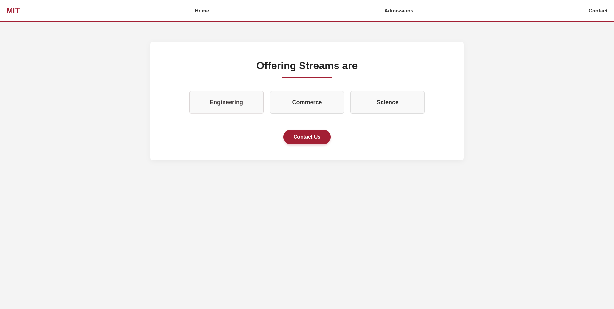

# MIT Web UI

A frontend university website inspired by the MIT website. The project showcases admissions information, academic programs, contact forms, featured news, events, and department pages through a clean multi-page interface.

## Features

- Homepage with featured news and events
- Admissions page
- Contact form
- Course information pages
- Responsive layout
- Multi-page navigation

## Tech Stack

<p>
  
  
</p>

## Project Structure

```text
mitweb/
├── pages/
├── images/
├── style.css
└── index.html
```

## Running Locally

```bash
git clone <repository-url>

cd mitweb
```

Open `index.html` in your browser.

## Running Tests

No automated tests are configured for this project.

## Integration Notes

This project can be extended with backend support for admissions management, student registration, and dynamic content management.

## Visuals

### Homepage


### Courses



### Course


### Contact


## Additional Resources

- MIT Official Website: https://www.mit.edu/
